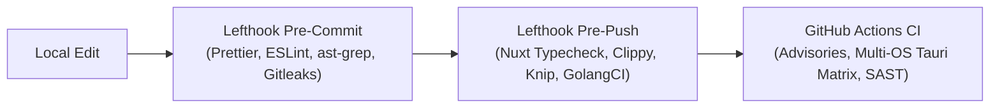

# Heretek-Games / Drop — AI Developer Guide

Welcome to **Drop**, an open-source, self-hosted game distribution and multiplayer platform maintained by [Heretek Games](https://github.com/Heretek-Games/drop) (transitioned from `Drop-OSS/drop` and `Heretek-AI/drop`).

This document defines architecture standards, toolchain requirements, commands, and quality gates for AI agents (Antigravity, Gemini CLI, etc.) and human developers.

---

## 1. Monorepo Architecture & Layout

Drop is a polyglot monorepo containing services, desktop clients, command-line utilities, and distribution manifests:

| Directory           | Stack                                                                     | Description                                                                                                    |
| :------------------ | :------------------------------------------------------------------------ | :------------------------------------------------------------------------------------------------------------- |
| **`server/`**       | Nuxt 3, Nitro, Vue 3, TypeScript, Prisma (7.10.0), Tailwind CSS, Protobuf | Core web app, REST API, WebSocket pub/sub, library management, and Server Plugin SPI.                          |
| **`backend/`**      | Go (`go.work`, module `core/`)                                            | High-performance backend game management and background sync services.                                         |
| **`desktop/`**      | Tauri v2, Nuxt 3 (`desktop/main/`), Rust (`desktop/src-tauri/`)           | Cross-platform desktop client (Windows, Linux, macOS) featuring native process interception.                   |
| **`cli/`**          | Rust                                                                      | Command-line utility (`downpour`) for interacting with Drop instances.                                         |
| **`torrential/`**   | Rust                                                                      | Peer-to-peer / torrent distribution engine.                                                                    |
| **`libraries/`**    | Rust & TypeScript                                                         | Shared crates (`droplet`, `droplet_types`, `libarchive`, `native_model`) and TS components (`libraries/base`). |
| **`distribution/`** | YAML / XML / Desktop                                                      | Packaging manifests: WinGet (`distribution/winget/`) and Linux Flatpak (`distribution/flatpak/`).              |

---

## 2. Key Architectural Systems & Patterns

### 2.1 Tauri High-DPI Window Architecture

- **Unified Window Model**: The desktop client uses `tauri::WebviewWindowBuilder::new(&handle, "main", WebviewUrl::App("main".into()))` directly in `desktop/src-tauri/src/lib.rs`.
- **Do NOT** use decoupled child webviews (`WindowBuilder` + `add_child(WebviewBuilder)`). Decoupled webviews cause physical/logical bounds desynchronization on Windows 4K displays with ~200%–300% DPI scaling, clipping the viewport to a fraction of the screen.
- Webview label is `"main"`, matching `desktop/src-tauri/capabilities/default.json`.

### 2.2 Server Plugin SPI & Dynamic Capabilities

Located in `server/server/internal/plugins/`:

- **`PluginManager`**: Dynamic routing (`/api/v1/plugins/[pluginId]/...`), atomic persistent JSON storage (`storage.ts`), and WebSocket event bus pub/sub.
- **Dynamic Discovery**: Scans `${dataDir}/plugins/*/drop-plugin.json` for external plugins on startup.
- **State Persistence**: Enables/disables plugins dynamically via `_state.json` without requiring server restarts.
- **Capability Sandboxing**: Plugins must explicitly declare permissions in `manifest.capabilities` (`routes`, `storage`, `websocket`, `events`, `network`). Violations fail-closed.
- **Builtin GSE Plugin**: `builtin/drop-gse.ts` coordinates multiplayer rooms, mesh networking metadata (Tailscale/ZeroTier), and player peer lists.

### 2.3 Client Launch Interceptor Pipeline (Rust)

Located in `desktop/src-tauri/process/`:

- **`LaunchInterceptor` Trait**: Exposes `pre_launch`, `on_running`, and `post_exit` hooks for game process orchestration.
- **`GseLaunchInterceptor`**:
  - **Anti-Cheat Safety**: Fails-closed if anti-cheat engines (EasyAntiCheat, BattlEye, etc.) are detected in the game directory.
  - **Binary Integrity**: Creates verified `.orig` backups of `steam_api.dll`, `steam_api64.dll`, or `libsteam_api.so` with SHA-256 manifest tracking.
  - **Configuration**: Generates `steam_settings/custom_broadcasts.txt` for P2P mesh discovery.
  - **Clean Teardown**: Automatically restores original game binaries on process termination (`post_exit`).

### 2.4 Desktop UI Conventions

- **Vue Union Type Narrowing**: In Vue templates, Discriminated Unions (such as `GameStatus` with `type: 'Installed'`) must be accessed through a typed computed property (e.g. `const installedData = computed(() => status.value?.type === 'Installed' ? status.value : undefined)`).
- **Settings**: Plugin management UI is located at `desktop/main/pages/settings/plugins.vue` with link in `settings.vue`.

---

## 3. Toolchain & Environment Requirements

| Tool         | Version / Requirement | Notes                                                                                                |
| :----------- | :-------------------- | :--------------------------------------------------------------------------------------------------- |
| **Node.js**  | 20+ / 24+ LTS         | Managed via `pnpm`.                                                                                  |
| **pnpm**     | 9+                    | Monorepo package manager (`pnpm-workspace.yaml`).                                                    |
| **Rust**     | `cargo +nightly`      | Nightly is required for workspace features (`nonpoison_mutex`, `iterator_try_collect`, `fn_traits`). |
| **Go**       | 1.24+                 | Matches `backend/go.work`.                                                                           |
| **Prisma**   | 7.10.0                | Pinned across workspace. Always run `pnpm install` after pulling schema changes.                     |
| **Lefthook** | 2.1+                  | Git hook manager for pre-commit and pre-push validation.                                             |

> [!NOTE]
> `desktop/src-tauri/Cargo.toml` specifies `[profile.dev.package.tokio] opt-level = 1` to avoid an upstream nightly compiler internal error (ICE) during debug compilation of Tokio.

---

## 4. Quality Gates & Enforcement



### Git Hooks (Enforced Locally)

- **Pre-commit**:
  - `gitleaks` (secret scan staged files)
  - `ast-grep scan` (structural AST linting)
  - `prettier --check` (code formatting)
  - `eslint --fix` (TypeScript/Vue linting)
- **Pre-push**:
  - `pnpm --filter drop run typecheck` (server TypeScript validation)
  - `clippy-changed.sh` (Rust clippy on modified crates)
  - `golangci-lint run` (Go static analysis)
  - `knip` (dead dependency reporting)

> [!IMPORTANT]
> **Never bypass hooks with `--no-verify`**. CI enforces these gates strictly. Fix errors locally before pushing.

---

## 5. Essential Commands

### Development & Verification

```sh
# Install workspace dependencies & generate Prisma client
pnpm install

# Typecheck server & Nuxt
pnpm --filter drop run typecheck

# Lint & check formatting
pnpm --filter drop run lint
pnpm exec prettier --check .

# Test Server Plugin SPI
pnpm --filter drop run test internal/plugins

# Test Rust Launch Interceptors
cargo +nightly test --manifest-path desktop/src-tauri/Cargo.toml --lib -p process

# Check Tauri desktop client
cargo +nightly check --manifest-path desktop/src-tauri/Cargo.toml --lib -p drop-app

# Build desktop client frontend
pnpm -C desktop build

# Run all pre-commit hooks manually
pnpm exec lefthook run pre-commit --all-files

# Validate GitHub Actions workflows
actionlint .github/workflows/*.yml
```

---

## 6. Commit & Contribution Guidelines

- **Commit Format**: Follow [Conventional Commits](https://www.conventionalcommits.org/) (e.g. `feat(plugins): ...`, `fix(desktop): ...`, `refactor(server): ...`).
- **Secret Hygiene**: Do not commit tokens, keys, or credentials. Use `.gitleaksignore` with specific commit fingerprints only for historical mock test fixtures.
- **Blame Hygiene**: Formatting-only passes should be recorded in `.git-blame-ignore-revs`.
